class: left, middle, bg_karl1, h1

 
## Entre algoritmos, likes y ciencias sociales computacionales

### Sebastián Massa Slimming 
### 22 de mayo 2025


```{css, echo = F}
.bg_karl1 {
  position: relative;
  z-index: 1;
}

.bg_karl1::before {    
      content: "";
      background-image: url('https://scitechdaily.com/images/Hacking-Cybersecurity.gif');
      background-size: cover;
      position: absolute;
      top: 0px;
      right: 0px;
      bottom: 0px;
      left: 0px;
      opacity: 1;
      z-index: -1;
}

.h1 {
  color: white;
  text-shadow: 2px 2px 4px #000000;
}

```

---
class: right, middle, inverse
# 1. Una breve presentación

```{css, echo = FALSE}
.inverse {
  background-color: #272822;
  color: #d6d6d6;
  text-shadow: 0 0 20px #333;
}
```

---
class: inverse


---
class: inverse
# Línea de desarrollo

Estudio de la [**tecnología y nuevos procesos de subjetivación en el contexto de Internet e inteligencia artificial (IA)**](), con un enfoque particular en el desarrollo y aplicaciones de técnicas computacionales para las ciencias sociales (utilizando y diseñando códigos/funciones en lenguajes de programación como R y Python).

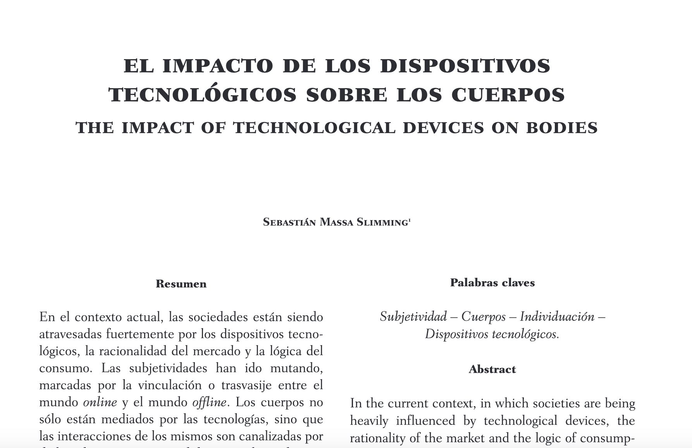
---
class: inverse
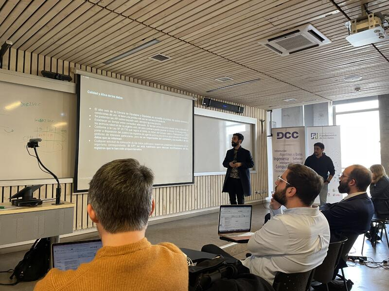

---
class: inverse
# Summer Institutes in Computational Social Science (SICSS)

Colaboración entre ciencias sociales y ciencias de la computación

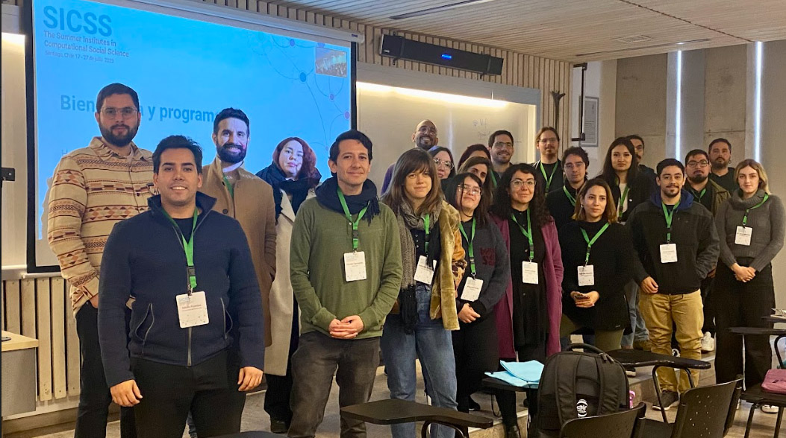

---
class: inverse


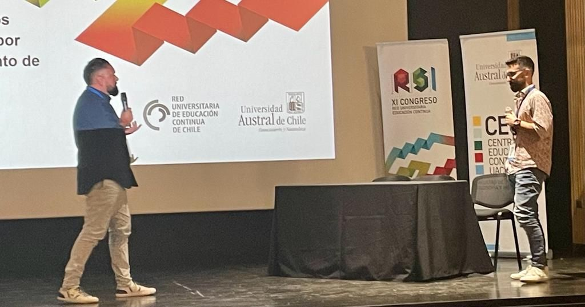

---

class: right, middle, inverse
# 2. ¿Mi objetivo?

```{css, echo = FALSE}
.inverse {
  background-color: #272822;
  color: #d6d6d6;
  text-shadow: 0 0 20px #333;
}
```

---
class: inverse
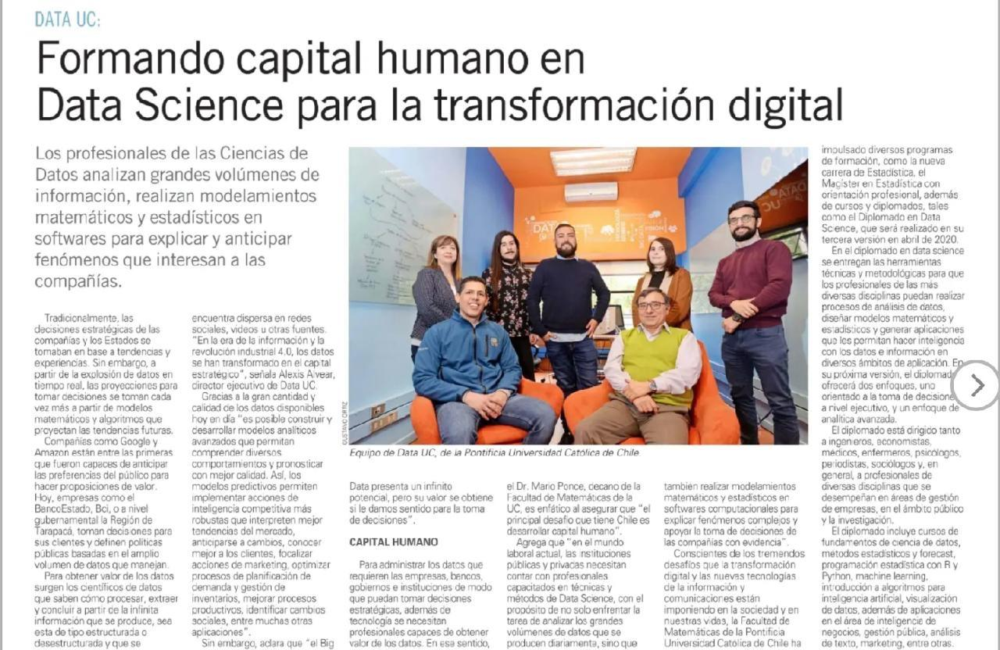

---

class: inverse, middle, center
# Open Federation For Sharing Civic Tech
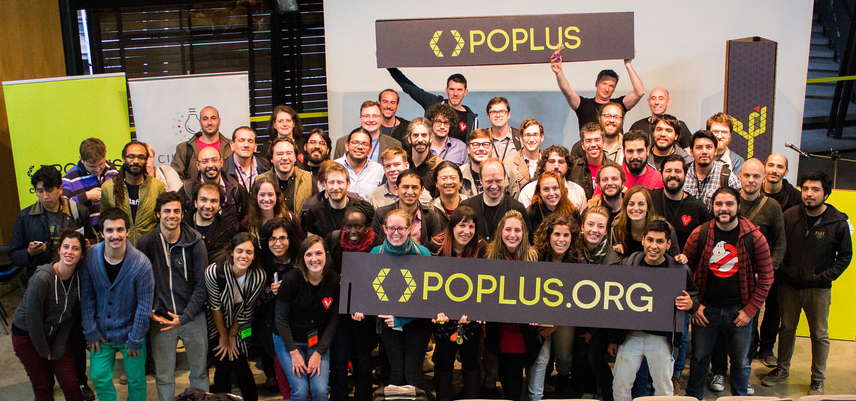

---
class: inverse, center
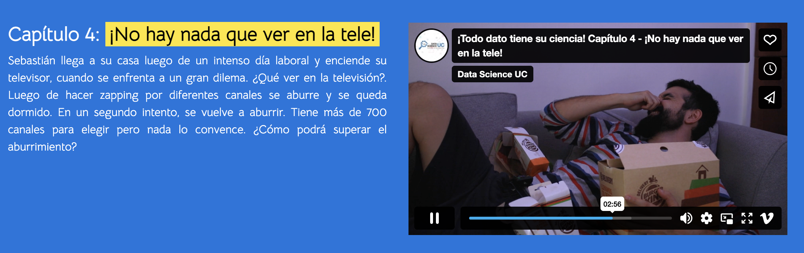


---
class: right, middle, inverse
# 3. ¿Pero cómo es realmente mi realidad?

```{css, echo = FALSE}
.inverse {
  background-color: #272822;
  color: #d6d6d6;
  text-shadow: 0 0 20px #333;
}
```

---
class: inverse, center
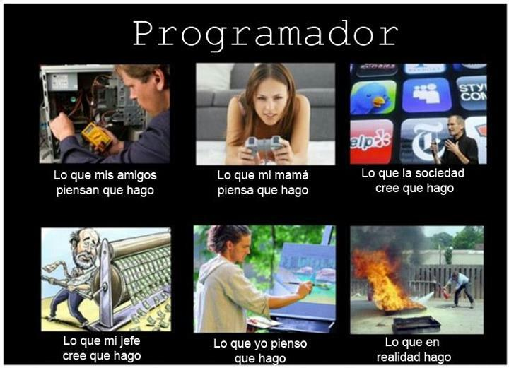

---


class: right, middle, inverse
# Mi sueño frustrado

.pull-left[
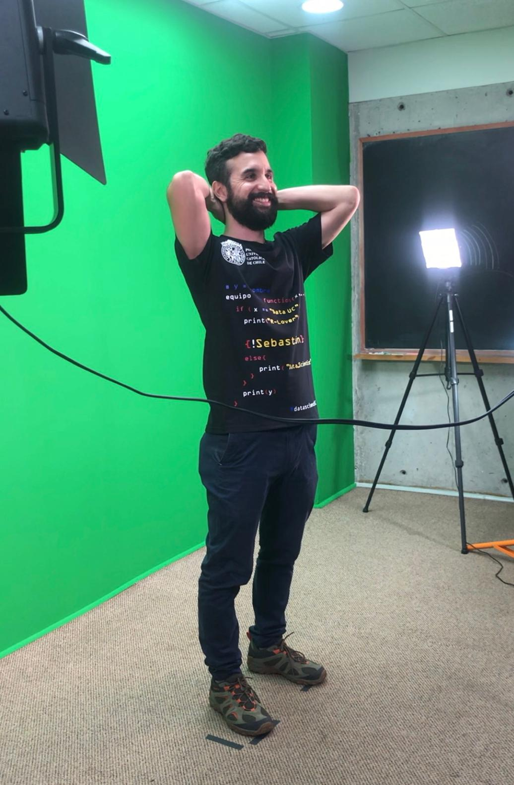
]

.pull-right[
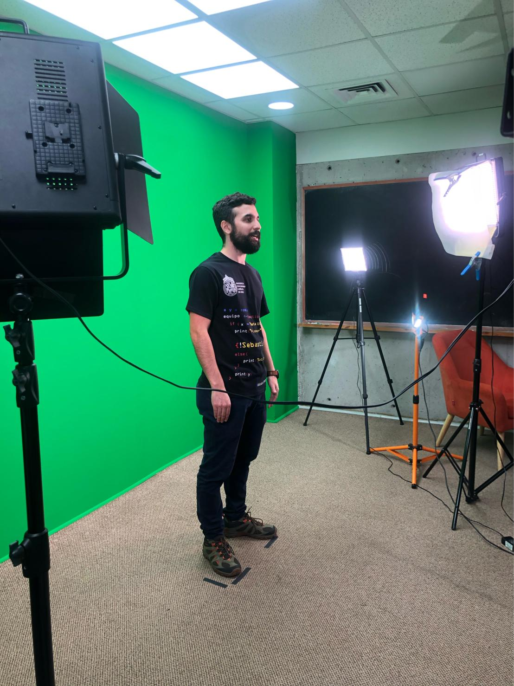
]

---
class: center, middle, inverse
# Un perro "mae"
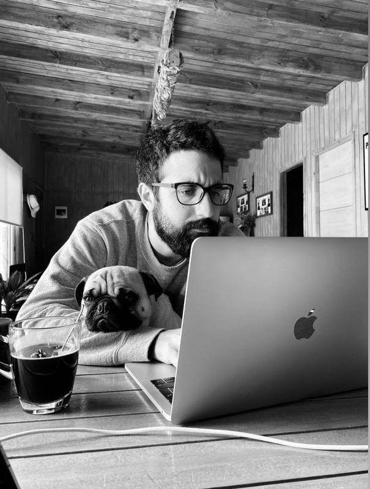

---

class: center, middle, inverse
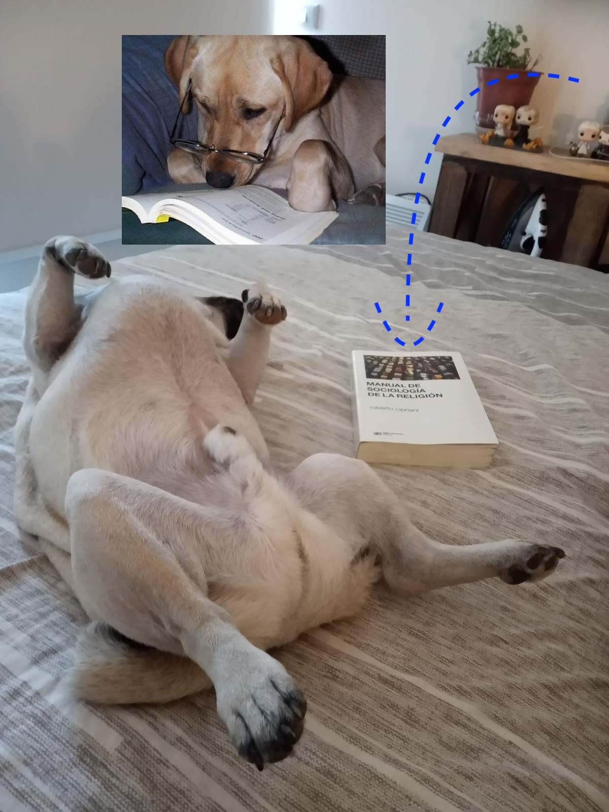

---
class: right, middle, inverse, bg_karl30, h30
# 4. ¿Y cómo ha sido la experiencia desde que inicié en esto? 

```{css, echo = F}
.bg_karl30 {
  position: relative;
  z-index: 1;
}

.bg_karl30::before {    
      content: "";
      background-image: url("https://i.pinimg.com/originals/0e/5f/29/0e5f291913819eeefcea5a8a6b388afe.gif");
      background-size: cover;
      position: absolute;
      top: 0px;
      right: 0px;
      bottom: 0px;
      left: 0px;
      opacity: 1;
      z-index: -1;
}

.h30 {
  color: white;
  text-shadow: 2px 2px 4px #000000;
}

```

---

class: right, middle, inverse, bg_karl31, h31

```{css, echo = F}
.bg_karl31 {
  position: relative;
  z-index: 1;
}

.bg_karl31::before {    
      content: "";
      background-image: url("https://i.redd.it/3z88nwl2qkg61.gif");
      background-size: cover;
      position: absolute;
      top: 0px;
      right: 0px;
      bottom: 0px;
      left: 0px;
      opacity: 1;
      z-index: -1;
}

.h31 {
  color: white;
  text-shadow: 2px 2px 4px #000000;
}

```

---

class: middle, right, inverse, bg_karl41, h41
# ¡Cometí muchos errores en el camino! 

```{css, echo = F}
.bg_karl41 {
  position: relative;
  z-index: 1;
}

.bg_karl41::before {    
      content: "";
      background-image: url("https://i.pinimg.com/originals/41/ef/34/41ef34590ba657ae90197568c560ae34.gif");
      background-size: cover;
      position: absolute;
      top: 0px;
      right: 0px;
      bottom: 0px;
      left: 0px;
      opacity: 1;
      z-index: -1;
}

.h41 {
  color: white;
  text-shadow: 2px 2px 4px #000000;
}

```

---

class: middle, right, inverse, bg_karl42, h42
# No encontré las causas rápidamente

```{css, echo = F}
.bg_karl42 {
  position: relative;
  z-index: 1;
}

.bg_karl42::before {    
      content: "";
      background-image: url("https://media.giphy.com/media/lq2u8GnHsDMTCzs5f4/giphy.gif");
      background-size: cover;
      position: absolute;
      top: 0px;
      right: 0px;
      bottom: 0px;
      left: 0px;
      opacity: 1;
      z-index: -1;
}

.h42 {
  color: white;
  text-shadow: 2px 2px 4px #000000;
}

```

---

class: middle, right, inverse, bg_karl43, h43
# Tuve rabia contra el mundo

```{css, echo = F}
.bg_karl43 {
  position: relative;
  z-index: 1;
}

.bg_karl43::before {    
      content: "";
      background-image: url("https://media.giphy.com/media/l0HlIxGxlE5AXV11m/source.gif");
      background-size: cover;
      position: absolute;
      top: 0px;
      right: 0px;
      bottom: 0px;
      left: 0px;
      opacity: 1;
      z-index: -1;
}

.h43 {
  color: white;
  text-shadow: 2px 2px 4px #000000;
}

```

---

class: middle, right, inverse, bg_karl44, h44
# Pero tuve que prestar atención a la lógica

```{css, echo = F}
.bg_karl44 {
  position: relative;
  z-index: 1;
}

.bg_karl44::before {    
      content: "";
      background-image: url("https://static.theclinic.cl/media/2021/11/dicaprio.gif");
      background-size: cover;
      position: absolute;
      top: 0px;
      right: 0px;
      bottom: 0px;
      left: 0px;
      opacity: 1;
      z-index: -1;
}

.h44 {
  color: white;
  text-shadow: 2px 2px 4px #000000;
}

```

---

class: middle, right, inverse, bg_karl45, h45 
# Siempre volvía al loop infinito de Google. No iba a inventar la rueda.

```{css, echo = F}
.bg_karl45 {
  position: relative;
  z-index: 1;
}

.bg_karl45::before {    
      content: "";
      background-image: url("https://i.redd.it/g2naxsim9do91.gif");
      background-size: cover;
      position: absolute;
      top: 0px;
      right: 0px;
      bottom: 0px;
      left: 0px;
      opacity: 1;
      z-index: -1;
}

.h45 {
  color: white;
  text-shadow: 2px 2px 4px #000000;
}

```

---

class: center, middle, bg_karl88, h88
# ¿Volver a estudiar matemática/estadística?

```{css, echo = F}
.bg_karl88 {
  position: relative;
  z-index: 1;
}

.bg_karl88::before {    
      content: "";
      background-image: url('https://i0.wp.com/media.giphy.com/media/3o7btPCcdNniyf0ArS/giphy.gif?w=1170&ssl=1');
      background-size: cover;
      position: absolute;
      top: 0px;
      right: 0px;
      bottom: 0px;
      left: 0px;
      opacity: 1;
      z-index: -1;
}

.h88 {
  color: white;
  text-shadow: 2px 2px 4px #000000;
}

```


---

class: center, middle, bg_karl6, h6

# En las dinámicas organizacionales, la conformación de equipos multidisciplinarios es muy útil.

```{css, echo = F}

.bg_karl6 {
  position: relative;
  z-index: 1;
}

.bg_karl6::before {    
      content: "";
      background-image: url('https://www.bu.edu/files/2019/06/DataScience-Header.gif');
      background-size: cover;
      position: absolute;
      top: 0px;
      right: 0px;
      bottom: 0px;
      left: 0px;
      opacity: 0.9;
      z-index: -1;
}

.h6 {
  color: white;
  text-shadow: 2px 2px 4px #000000;
}

```

---

class: center, middle, bg_karl7, h7

# Programar es un arte. Toda persona interesada puede aprender. 

```{css, echo = F}

.bg_karl7 {
  position: relative;
  z-index: 1;
}

.bg_karl7::before {    
      content: "";
      background-image: url('https://i0.wp.com/analyticsindiamag.com/wp-content/uploads/2022/11/programming.gif?fit=1281%2C716&ssl=1');
      background-size: cover;
      position: absolute;
      top: 0px;
      right: 0px;
      bottom: 0px;
      left: 0px;
      opacity: 0.9;
      z-index: -1;
}

.h7 {
  color: white;
  text-shadow: 2px 2px 4px #000000;
}

```

---
class: center, middle, bg_karl2, h3

# Los datos necesitan de relatos para poder ser internalizados adecuadamente.

```{css, echo = F}

.bg_karl2 {
  position: relative;
  z-index: 1;
}

.bg_karl2::before {    
      content: "";
      background-image: url('https://cdn.dribbble.com/users/31818/screenshots/5054596/gif-dribb.gif');
      background-size: cover;
      position: absolute;
      top: 0px;
      right: 0px;
      bottom: 0px;
      left: 0px;
      opacity: 0.9;
      z-index: -1;
}

.h3 {
  color: white;
  text-shadow: 2px 2px 4px #000000;
}

```

---
class: right, middle, inverse
# 5. ¿Desde dónde podemos aportar?

```{css, echo = FALSE}
.inverse {
  background-color: #272822;
  color: #d6d6d6;
  text-shadow: 0 0 20px #333;
}
```

---

## [Natural Language Processing]()


---

# Aplicaciones de [Text Mining]()


--- 


---
class: right bg_karl14 h14
## [Sentimental analysis]()

```{css, echo = F}

.bg_karl14 {
  position: relative;
  z-index: 1;
}

.bg_karl14::before {    
      content: "";
      background-image: url('https://www.rcharlie.com/images/blog/fitter-happier/fitter_happier_gif.gif');
      background-size: cover;
      position: absolute;
      top: 0px;
      right: 0px;
      bottom: 0px;
      left: 0px;
      opacity: 0.9;
      z-index: -1;
}

.h14 {
  color: black;
  text-shadow: 2px 2px 4px white;
}

```

---
## [Sentimental analysis]()


---
class: right middle bg_karl10 h10
# Investigación de mercados

```{css, echo = F}

.bg_karl10 {
  position: relative;
  z-index: 1;
}

.bg_karl10::before {    
      content: "";
      background-image: url('https://www.rcharlie.com/images/blog/coachellar/3dplot.gif');
      background-size: cover;
      position: absolute;
      top: 0px;
      right: 0px;
      bottom: 0px;
      left: 0px;
      opacity: 0.9;
      z-index: -1;
}

.h10 {
  color: black;
  text-shadow: 2px 2px 4px white;
}

```

---
class: middle center bg_karl37 h7
# Aplicaciones web 

```{css, echo = F}

.bg_karl37 {
  position: relative;
  z-index: 1;
}

.bg_karl37::before {    
      content: "";
      background-image: url('https://www.imn.ac.cr/imagenes-sat/IRVISCR.gif');
      background-size: cover;
      position: absolute;
      top: 0px;
      right: 0px;
      bottom: 0px;
      left: 0px;
      opacity: 0.9;
      z-index: -1;
}

.h7 {
  color: white;
  text-shadow: 2px 2px 4px #000000;
}

```


---

# Técnicas de [web scraping]()


---

# Simulaciones matemática con [iteraciones]()


---
# Aplicaciones de [geolocalización]()

<iframe src="https://code.iadb.org/sites/default/files/2022-11/VideoWISH01_0.gif" style="border: 0; width: 100%; height: 60%""></iframe>

---

# Aplicaciones de [análisis de redes]()

<iframe src="https://miro.medium.com/v2/resize:fit:2000/1*x3wy4eO68EhrgLVY231DWg.gif" style="border: 0; width: 100%; height: 60%""></iframe>

---

class: right, middle, inverse
# 6. ¿Qué retos tenemos hoy?

```{css, echo = FALSE}
.inverse {
  background-color: #272822;
  color: #d6d6d6;
  text-shadow: 0 0 20px #333;
}
```

---

class: middle center bg_karl20 h20

```{css, echo = F}

.bg_karl20 {
  position: relative;
  z-index: 1;
}

.bg_karl20::before {    
      content: "";
      background-image: url('https://c.tenor.com/yGfc8apeh2UAAAAC/pills-drugs.gif');
      background-size: cover;
      position: absolute;
      top: 0px;
      right: 0px;
      bottom: 0px;
      left: 0px;
      opacity: 0.9;
      z-index: -1;
}

.h20 {
  color: white;
  text-shadow: 2px 2px 4px #000000;
}

```


---

class: middle center bg_karl21 h21

```{css, echo = F}

.bg_karl21 {
  position: relative;
  z-index: 1;
}

.bg_karl21::before {    
      content: "";
      background-image: url('https://i0.wp.com/youarenotsosmart.com/wp-content/uploads/2013/05/bomberhit.gif');
      background-size: cover;
      position: absolute;
      top: 0px;
      right: 0px;
      bottom: 0px;
      left: 0px;
      opacity: 1;
      z-index: -1;
}

.h21 {
  color: white;
  text-shadow: 2px 2px 4px #000000;
}

```

---
class: middle center bg_karl21 h21


```{css, echo = F}

.bg_karl21 {
  position: relative;
  z-index: 1;
}

.bg_karl21::before {    
      content: "";
      background-image: url('https://i0.wp.com/youarenotsosmart.com/wp-content/uploads/2013/05/bomberhit.gif');
      background-size: cover;
      position: absolute;
      top: 0px;
      right: 0px;
      bottom: 0px;
      left: 0px;
      opacity: 1;
      z-index: -1;
}

.h21 {
  color: white;
  text-shadow: 2px 2px 4px #000000;
}

```

---

class: right, middle, inverse

# 7. ¿Veamos un ejemplo práctico?

```{css, echo = FALSE}
.inverse {
  background-color: #272822;
  color: #d6d6d6;
  text-shadow: 0 0 20px #333;
}
```

