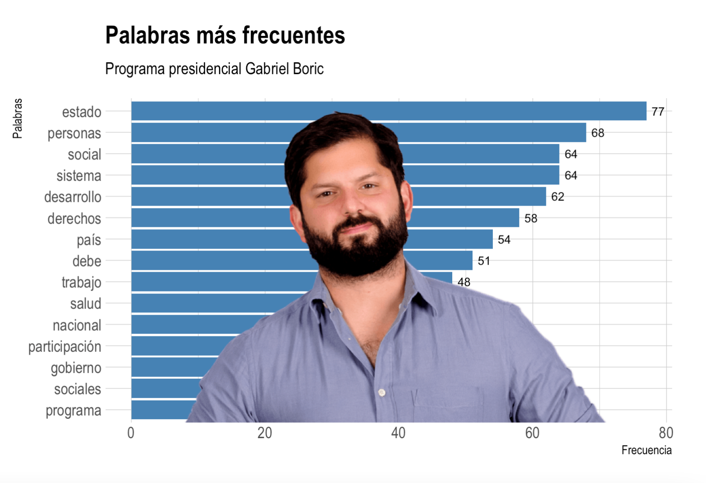

class: left, middle, bg_karl1, h1

 
## Entre algoritmos, likes y ciencias sociales computacionales

### Sebastián Massa Slimming 
### 7 de agosto 2025


```{css, echo = F}
.bg_karl1 {
  position: relative;
  z-index: 1;
}

.bg_karl1::before {    
      content: "";
      background-image: url('https://scitechdaily.com/images/Hacking-Cybersecurity.gif');
      background-size: cover;
      position: absolute;
      top: 0px;
      right: 0px;
      bottom: 0px;
      left: 0px;
      opacity: 1;
      z-index: -1;
}

.h1 {
  color: white;
  text-shadow: 2px 2px 4px #000000;
}

```

---
class: right, middle, inverse
# 1. Una breve presentación

```{css, echo = FALSE}
.inverse {
  background-color: #272822;
  color: #d6d6d6;
  text-shadow: 0 0 20px #333;
}
```

---
class: inverse


---
class: inverse
# Línea de desarrollo

Mi trayectoria académica y profesional se ha orientado al [**estudio e investigación de la tecnología, las identidades y los procesos de subjetivación en entornos digitales, con especial énfasis en el impacto de Internet y la IA en la sociedad contemporánea**](). Con enfoque particular en el diseño y aplicación de técnicas computacionales para las ciencias sociales, utilizando lenguajes de programación como R y Python.


---
class: inverse
# Summer Institutes in Computational Social Science (SICSS)

Colaboración entre ciencias sociales y ciencia de la computación


---

class: inverse


---
class: inverse


---

class: right, middle, inverse
# 2. ¿Mi objetivo?

```{css, echo = FALSE}
.inverse {
  background-color: #272822;
  color: #d6d6d6;
  text-shadow: 0 0 20px #333;
}
```

---
class: inverse


---
class: inverse


---

class: inverse, middle, center
# Open Federation For Sharing Civic Tech


---
class: inverse
# Asociación de Marketing Digital y Data


---
class: inverse, center


---
class: inverse, center


---

class: inverse, center, middle

---

class: right, middle, inverse
# 3. Alguno de los proyectos ejecutados

```{css, echo = FALSE}
.inverse {
  background-color: #272822;
  color: #d6d6d6;
  text-shadow: 0 0 20px #333;
}
```

---

class: inverse
.pull-left[

]

.pull-right[

]
---
class: center, middle
# Google Mobility Report 


---
class: inverse
# Índice Transbank


---


---

class: inverse
# Graficador Centro de Estudios Públicos


---
class: inverse
# Kit Digital


---

class: right, middle, inverse
# ¿Proyectos actuales?

```{css, echo = FALSE}
.inverse {
  background-color: #272822;
  color: #d6d6d6;
  text-shadow: 0 0 20px #333;
}
```

---
# Fondecyt de Iniciación N°11240713

Implementar algoritmo de web scraping con Python y R para extracción de información de toda la dotación ministerial
histórica del Estado de Chile, en proyecto titulado: "Cambio político y reconfiguraciones profesionales del Estado en Chile
2015-2025: explorando afinidades entre alternancia en el poder y emergencia de nuevos profesionalismos públicos y
tecnocracias post-neoliberales".


---
# App de denuncias por delitos sexuales

Creación de herramienta que facilita el acceso a información de manera interactiva y sencilla respecto al ingreso y
tramitación de causas de delitos sexuales cometidos contra niños, niñas y adolescentes, considerando datos del Ministerio
Público por Ley de Transparencia.


---
# Análisis de brechas entre universidades e industria


---
# Scoring de perfiles laborales (Trabajando.com) vía web scraping para determinar "perfil ideal"


---
class: right, middle, inverse
# 4. ¿Pero cómo es realmente mi realidad?

```{css, echo = FALSE}
.inverse {
  background-color: #272822;
  color: #d6d6d6;
  text-shadow: 0 0 20px #333;
}
```

---
class: inverse, center


---


class: right, middle, inverse
# Mi sueño frustrado

.pull-left[

]

.pull-right[

]

---
class: center, middle, inverse
# Un perro "pegote"


---

class: center, middle, inverse


---
class: right, middle, inverse, bg_karl30, h30
# 5. ¿Y cómo ha sido la experiencia desde que inicié en esto? 

```{css, echo = F}
.bg_karl30 {
  position: relative;
  z-index: 1;
}

.bg_karl30::before {    
      content: "";
      background-image: url("https://i.pinimg.com/originals/0e/5f/29/0e5f291913819eeefcea5a8a6b388afe.gif");
      background-size: cover;
      position: absolute;
      top: 0px;
      right: 0px;
      bottom: 0px;
      left: 0px;
      opacity: 1;
      z-index: -1;
}

.h30 {
  color: white;
  text-shadow: 2px 2px 4px #000000;
}

```

---

class: right, middle, inverse, bg_karl31, h31

```{css, echo = F}
.bg_karl31 {
  position: relative;
  z-index: 1;
}

.bg_karl31::before {    
      content: "";
      background-image: url("https://i.redd.it/3z88nwl2qkg61.gif");
      background-size: cover;
      position: absolute;
      top: 0px;
      right: 0px;
      bottom: 0px;
      left: 0px;
      opacity: 1;
      z-index: -1;
}

.h31 {
  color: white;
  text-shadow: 2px 2px 4px #000000;
}

```

---

class: middle, right, inverse, bg_karl41, h41
# ¡Cometí muchos errores en el camino! 

```{css, echo = F}
.bg_karl41 {
  position: relative;
  z-index: 1;
}

.bg_karl41::before {    
      content: "";
      background-image: url("https://i.pinimg.com/originals/41/ef/34/41ef34590ba657ae90197568c560ae34.gif");
      background-size: cover;
      position: absolute;
      top: 0px;
      right: 0px;
      bottom: 0px;
      left: 0px;
      opacity: 1;
      z-index: -1;
}

.h41 {
  color: white;
  text-shadow: 2px 2px 4px #000000;
}

```

---

class: middle, right, inverse, bg_karl42, h42
# No encontré las causas rápidamente

```{css, echo = F}
.bg_karl42 {
  position: relative;
  z-index: 1;
}

.bg_karl42::before {    
      content: "";
      background-image: url("https://media.giphy.com/media/lq2u8GnHsDMTCzs5f4/giphy.gif");
      background-size: cover;
      position: absolute;
      top: 0px;
      right: 0px;
      bottom: 0px;
      left: 0px;
      opacity: 1;
      z-index: -1;
}

.h42 {
  color: white;
  text-shadow: 2px 2px 4px #000000;
}

```

---

class: middle, right, inverse, bg_karl43, h43
# Tuve rabia contra el mundo 

```{css, echo = F}
.bg_karl43 {
  position: relative;
  z-index: 1;
}

.bg_karl43::before {    
      content: "";
      background-image: url("https://media.giphy.com/media/l0HlIxGxlE5AXV11m/source.gif");
      background-size: cover;
      position: absolute;
      top: 0px;
      right: 0px;
      bottom: 0px;
      left: 0px;
      opacity: 1;
      z-index: -1;
}

.h43 {
  color: white;
  text-shadow: 2px 2px 4px #000000;
}

```

---

class: middle, right, inverse, bg_karl44, h44
# Pero tuve que prestar atención a la lógica

```{css, echo = F}
.bg_karl44 {
  position: relative;
  z-index: 1;
}

.bg_karl44::before {    
      content: "";
      background-image: url("https://static.theclinic.cl/media/2021/11/dicaprio.gif");
      background-size: cover;
      position: absolute;
      top: 0px;
      right: 0px;
      bottom: 0px;
      left: 0px;
      opacity: 1;
      z-index: -1;
}

.h44 {
  color: white;
  text-shadow: 2px 2px 4px #000000;
}

```

---

class: right, middle, inverse, bg_karl82, h82

```{css, echo = F}
.bg_karl82 {
  position: relative;
  z-index: 1;
}

.bg_karl82::before {    
      content: "";
      background-image: url("https://i.pinimg.com/originals/14/63/3e/14633e66ab05b4ad29b36a592a27070e.gif");
      background-size: cover;
      position: absolute;
      top: 0px;
      right: 0px;
      bottom: 0px;
      left: 0px;
      opacity: 1;
      z-index: -1;
}

.h82 {
  color: white;
  text-shadow: 2px 2px 4px #000000;
}

```


---
class: right, middle, inverse, bg_karl35, h35

```{css, echo = F}
.bg_karl35 {
  position: relative;
  z-index: 1;
}

.bg_karl35::before {    
      content: "";
      background-image: url("https://media1.tenor.com/m/i3lImBg2UEQAAAAd/scaler-create-impact.gif");
      background-size: cover;
      position: absolute;
      top: 0px;
      right: 0px;
      bottom: 0px;
      left: 0px;
      opacity: 1;
      z-index: -1;
}

.h35 {
  color: white;
  text-shadow: 2px 2px 4px #000000;
}

```


---

class: middle, right, inverse, bg_karl5, h5
# Entramos en un error, solucionamos y volvemos...

```{css, echo = F}
.bg_karl5 {
  position: relative;
  z-index: 1;
}

.bg_karl5::before {    
      content: "";
      background-image: url("https://i.redd.it/s28zf8y4pea91.gif");
      background-size: cover;
      position: absolute;
      top: 0px;
      right: 0px;
      bottom: 0px;
      left: 0px;
      opacity: 1;
      z-index: -1;
}

.h5 {
  color: white;
  text-shadow: 2px 2px 4px #000000;
}

```

---

class: middle, right, inverse, bg_karl45, h45 
# Siempre volvía al loop infinito de Google. No iba a inventar la rueda.

```{css, echo = F}
.bg_karl45 {
  position: relative;
  z-index: 1;
}

.bg_karl45::before {    
      content: "";
      background-image: url("https://i.redd.it/g2naxsim9do91.gif");
      background-size: cover;
      position: absolute;
      top: 0px;
      right: 0px;
      bottom: 0px;
      left: 0px;
      opacity: 1;
      z-index: -1;
}

.h45 {
  color: white;
  text-shadow: 2px 2px 4px #000000;
}

```

---

class: center, middle, bg_karl88, h88
# ¿Volver a estudiar matemática/estadística?

```{css, echo = F}
.bg_karl88 {
  position: relative;
  z-index: 1;
}

.bg_karl88::before {    
      content: "";
      background-image: url('https://i0.wp.com/media.giphy.com/media/3o7btPCcdNniyf0ArS/giphy.gif?w=1170&ssl=1');
      background-size: cover;
      position: absolute;
      top: 0px;
      right: 0px;
      bottom: 0px;
      left: 0px;
      opacity: 1;
      z-index: -1;
}

.h88 {
  color: white;
  text-shadow: 2px 2px 4px #000000;
}

```


---

class: center, middle, bg_karl6, h6

# En las dinámicas organizacionales, la conformación de equipos multidisciplinarios es muy útil.

```{css, echo = F}

.bg_karl6 {
  position: relative;
  z-index: 1;
}

.bg_karl6::before {    
      content: "";
      background-image: url('https://www.bu.edu/files/2019/06/DataScience-Header.gif');
      background-size: cover;
      position: absolute;
      top: 0px;
      right: 0px;
      bottom: 0px;
      left: 0px;
      opacity: 0.9;
      z-index: -1;
}

.h6 {
  color: white;
  text-shadow: 2px 2px 4px #000000;
}

```

---

class: center, middle, bg_karl7, h7

# Programar es un arte. Toda persona interesada puede aprender. 

```{css, echo = F}

.bg_karl7 {
  position: relative;
  z-index: 1;
}

.bg_karl7::before {    
      content: "";
      background-image: url('https://i0.wp.com/analyticsindiamag.com/wp-content/uploads/2022/11/programming.gif?fit=1281%2C716&ssl=1');
      background-size: cover;
      position: absolute;
      top: 0px;
      right: 0px;
      bottom: 0px;
      left: 0px;
      opacity: 0.9;
      z-index: -1;
}

.h7 {
  color: white;
  text-shadow: 2px 2px 4px #000000;
}

```

---
class: center, middle, bg_karl2, h3

# Los datos necesitan de relatos para poder ser internalizados adecuadamente.

```{css, echo = F}

.bg_karl2 {
  position: relative;
  z-index: 1;
}

.bg_karl2::before {    
      content: "";
      background-image: url('https://cdn.dribbble.com/users/31818/screenshots/5054596/gif-dribb.gif');
      background-size: cover;
      position: absolute;
      top: 0px;
      right: 0px;
      bottom: 0px;
      left: 0px;
      opacity: 0.9;
      z-index: -1;
}

.h3 {
  color: white;
  text-shadow: 2px 2px 4px #000000;
}

```

---

class: center, middle, bg_karl206, h206

# Donde termina la intuición, comienzan los datos.

Comprender la política es leer entre datos, porque donde termina la intuición, comienzan los datos. El poder de decidir con evidencia nos invita a ver más allá del discurso, aplicando datos y estadística en ciencia política. Pensar políticamente es también analizar con datos, porque toda decisión política merece un buen análisis.

```{css, echo = F}

.bg_karl206 {
  position: relative;
  z-index: 1;
}

.bg_karl206::before {    
      content: "";
      background-image: url('https://www.bu.edu/files/2019/06/DataScience-Header.gif');
      background-size: cover;
      position: absolute;
      top: 0px;
      right: 0px;
      bottom: 0px;
      left: 0px;
      opacity: 0.9;
      z-index: -1;
}

.h206 {
  color: white;
  text-shadow: 2px 2px 4px #000000;
}

```

---
class: right, middle, inverse
# 6. ¿Desde dónde podemos aportar?

```{css, echo = FALSE}
.inverse {
  background-color: #272822;
  color: #d6d6d6;
  text-shadow: 0 0 20px #333;
}
```

---

## [Natural Language Processing]()


---
## [Text Mining]()


---
## [Text Mining]()


---
class: right bg_karl14 h14
## [Sentimental analysis]()

```{css, echo = F}

.bg_karl14 {
  position: relative;
  z-index: 1;
}

.bg_karl14::before {    
      content: "";
      background-image: url('https://www.rcharlie.com/images/blog/fitter-happier/fitter_happier_gif.gif');
      background-size: cover;
      position: absolute;
      top: 0px;
      right: 0px;
      bottom: 0px;
      left: 0px;
      opacity: 0.9;
      z-index: -1;
}

.h14 {
  color: black;
  text-shadow: 2px 2px 4px white;
}

```

---
## [Sentimental analysis]()


---
class: right middle bg_karl10 h10
# Investigación de mercados

```{css, echo = F}

.bg_karl10 {
  position: relative;
  z-index: 1;
}

.bg_karl10::before {    
      content: "";
      background-image: url('https://www.rcharlie.com/images/blog/coachellar/3dplot.gif');
      background-size: cover;
      position: absolute;
      top: 0px;
      right: 0px;
      bottom: 0px;
      left: 0px;
      opacity: 0.9;
      z-index: -1;
}

.h10 {
  color: black;
  text-shadow: 2px 2px 4px white;
}

```

---
class: middle center bg_karl37 h7
# Aplicaciones web 

```{css, echo = F}

.bg_karl37 {
  position: relative;
  z-index: 1;
}

.bg_karl37::before {    
      content: "";
      background-image: url('https://humansofdata.atlan.com/wp-content/uploads/2019/01/water_avail.gif');
      background-size: cover;
      position: absolute;
      top: 0px;
      right: 0px;
      bottom: 0px;
      left: 0px;
      opacity: 0.9;
      z-index: -1;
}

.h7 {
  color: white;
  text-shadow: 2px 2px 4px #000000;
}

```


---

# Técnicas de [web scraping]()


---
# Técnicas de [web scraping]()


---

# Aplicaciones en [sociología del fútbol]()


---

# Simulaciones matemática con [iteraciones]()


---
# Aplicaciones de [geolocalización]()

<iframe src="https://code.iadb.org/sites/default/files/2022-11/VideoWISH01_0.gif" style="border: 0; width: 100%; height: 60%""></iframe>

---

# Aplicaciones de [análisis de redes]()

<iframe src="https://miro.medium.com/v2/resize:fit:2000/1*x3wy4eO68EhrgLVY231DWg.gif" style="border: 0; width: 100%; height: 60%""></iframe>

---

## Ejemplo específico

<iframe src="images/highchart.html" style="border: 0; width: 100%; height: 80%""></iframe>

---

class: right, middle, inverse
# 7. ¿Qué retos tenemos hoy?

```{css, echo = FALSE}
.inverse {
  background-color: #272822;
  color: #d6d6d6;
  text-shadow: 0 0 20px #333;
}
```

---

class: middle center bg_karl20 h20

```{css, echo = F}

.bg_karl20 {
  position: relative;
  z-index: 1;
}

.bg_karl20::before {    
      content: "";
      background-image: url('https://c.tenor.com/yGfc8apeh2UAAAAC/pills-drugs.gif');
      background-size: cover;
      position: absolute;
      top: 0px;
      right: 0px;
      bottom: 0px;
      left: 0px;
      opacity: 0.9;
      z-index: -1;
}

.h20 {
  color: white;
  text-shadow: 2px 2px 4px #000000;
}

```


---

class: middle center bg_karl21 h21

```{css, echo = F}

.bg_karl21 {
  position: relative;
  z-index: 1;
}

.bg_karl21::before {    
      content: "";
      background-image: url('https://i0.wp.com/youarenotsosmart.com/wp-content/uploads/2013/05/bomberhit.gif');
      background-size: cover;
      position: absolute;
      top: 0px;
      right: 0px;
      bottom: 0px;
      left: 0px;
      opacity: 1;
      z-index: -1;
}

.h21 {
  color: white;
  text-shadow: 2px 2px 4px #000000;
}

```

---
class: middle center bg_karl21 h21


```{css, echo = F}

.bg_karl21 {
  position: relative;
  z-index: 1;
}

.bg_karl21::before {    
      content: "";
      background-image: url('https://i0.wp.com/youarenotsosmart.com/wp-content/uploads/2013/05/bomberhit.gif');
      background-size: cover;
      position: absolute;
      top: 0px;
      right: 0px;
      bottom: 0px;
      left: 0px;
      opacity: 1;
      z-index: -1;
}

.h21 {
  color: white;
  text-shadow: 2px 2px 4px #000000;
}

```

---

class: right, middle, inverse
# 8. ¿Veamos un ejemplo práctico?

```{css, echo = FALSE}
.inverse {
  background-color: #272822;
  color: #d6d6d6;
  text-shadow: 0 0 20px #333;
}
```

---
class: inverse

---
class: inverse

---
class: inverse

---
class: inverse

---
class: inverse


---

class: right, middle, inverse
# 9. ¿Qué aprenderemos en este curso?

```{css, echo = FALSE}
.inverse {
  background-color: #272822;
  color: #d6d6d6;
  text-shadow: 0 0 20px #333;
}
```

.pull-left[
$$\bar{X}=\frac{1}{n}\sum_{i=1}^nX_i$$
$$\sigma = \sqrt{\frac{1}{N} \sum_{i=1}^N (x_i - \mu)^2}$$
$$r = \frac{{}\sum_{i=1}^{n} (x_i - \overline{x})(y_i - \overline{y})}
{\sqrt{\sum_{i=1}^{n} (x_i - \overline{x})^2(y_i - \overline{y})^2}}$$
$$P(A \mid B) = \frac{P(B \mid A) \cdot P(A)}{P(B)}$$
$$t = \frac{\bar{X} - \mu_0}{s / \sqrt{n}}$$
$$\begin{equation}
\hat{Y}_i = \hat{\beta}_0 + \hat{\beta}_1 X_i + \hat{\epsilon}_i
\end{equation}$$

]

.pull-right[

]


---

class: right, middle, inverse
# 10. Detalles administrativos

```{css, echo = FALSE}
.inverse {
  background-color: #272822;
  color: #d6d6d6;
  text-shadow: 0 0 20px #333;
}
```

---

## Detalles administrativos

**1. Evaluaciones parciales (60%).**

Se realizarán dos pruebas solemnes, cada una con un peso del 30% de la nota de
presentación. Estas evaluaciones incluirán interpretación de datos y ejercicios prácticos.
Se realizarán de manera presencial e individual, en el laboratorio de computación, según el
calendario del curso.

**2. Trabajos aplicados (40%).**

Se desarrollarán tres trabajos aplicados, dos de ellos en parejas y uno de forma individual:

- Trabajo 1 (en parejas): 14%
- Trabajo 2 (individual): 13%
- Trabajo 3 (en parejas): 13%

La nota de presentación al examen corresponde al promedio ponderado de las dos pruebas
solemnes y los tres trabajos, y representa el 70% de la nota final del curso. El 30% restante
corresponde a la nota del examen final.

Para tener derecho a rendir el examen final, la **nota de presentación debe ser igual o superior a
3.5**.

---
## Detalles administrativos

**3. Eximición del examen.**

Los estudiantes podrán eximirse del examen final si cumplen con las siguientes condiciones:

- Obtener una nota de presentación igual o superior a 5,5.
- **No tener notas inferiores a 4,0 en ninguna de las pruebas solemnes**.
- Cumplir con un mínimo de 70% de asistencia a las clases.

---

class: right, middle, inverse
# 11. ¿Cómo se espera la experiencia en el curso?

```{css, echo = FALSE}
.inverse {
  background-color: #272822;
  color: #d6d6d6;
  text-shadow: 0 0 20px #333;
}
```

---


class: center, middle, inverse
# Cuando nos enfrentamos a las evaluaciones


---

class: center, middle, inverse
# Cuando resolvemos algo con lenguaje de programación


---

class: center, middle, inverse
# Escuchando al profesor mientras hace el monólogo


---
class: right, top, inverse, bg_karl77, h77
# Curva de aprendizaje

```{css, echo = F}
.bg_karl77 {
  position: relative;
  z-index: 1;
}

.bg_karl77::before {    
      content: "";
      background-image: url("https://blog.mathspace.co/content/images/2023/10/Milo-Fixing-Maths-GIF.gif");
      background-size: cover;
      position: absolute;
      top: 0px;
      right: 0px;
      bottom: 0px;
      left: 0px;
      opacity: 1;
      z-index: -1;
}

.h77 {
  color: white;
  text-shadow: 2px 2px 4px #000000;
}

```

---

class: right, middle, inverse, bg_karl156, h156
# ¿Qué es una variable? 

```{css, echo = F}
.bg_karl156 {
  position: relative;
  z-index: 1;
}

.bg_karl156::before {    
      content: "";
      background-image: url("https://media.tenor.com/DmflrPpBB8cAAAAM/math-calculating.gif");
      background-size: cover;
      position: absolute;
      top: 0px;
      right: 0px;
      bottom: 0px;
      left: 0px;
      opacity: 1;
      z-index: -1;
}

.h156 {
  color: white;
  text-shadow: 2px 2px 4px #000000;
}

```

---

class: middle, right, inverse, bg_karl123, h123
# ¡No me corre el código! 

```{css, echo = F}
.bg_karl123 {
  position: relative;
  z-index: 1;
}

.bg_karl123::before {    
      content: "";
      background-image: url("https://miro.medium.com/v2/resize:fit:600/1*-B-vw5OePMVaPm-FSxfoPw.gif");
      background-size: cover;
      position: absolute;
      top: 0px;
      right: 0px;
      bottom: 0px;
      left: 0px;
      opacity: 1;
      z-index: -1;
}

.h123 {
  color: white;
  text-shadow: 2px 2px 4px #000000;
}

```

---

class: middle, right, inverse, bg_karl122, h122
# Empiezo a entender la lógica

```{css, echo = F}
.bg_karl122 {
  position: relative;
  z-index: 1;
}

.bg_karl122::before {    
      content: "";
      background-image: url("https://images.squarespace-cdn.com/content/v1/53b466b0e4b079af0445d8f2/1585024512595-FPBFCZGJ5HM427GAGWCR/giphy.gif");
      background-size: cover;
      position: absolute;
      top: 0px;
      right: 0px;
      bottom: 0px;
      left: 0px;
      opacity: 1;
      z-index: -1;
}

.h122 {
  color: white;
  text-shadow: 2px 2px 4px #000000;
}

```

---

class: middle, right, inverse, bg_karl120, h120
# Vuelvo a un desafío...

```{css, echo = F}
.bg_karl120 {
  position: relative;
  z-index: 1;
}

.bg_karl120::before {    
      content: "";
      background-image: url("https://static.tildacdn.com/tild6365-3363-4166-b662-646237663465/what_is_the_most_pop.gif");
      background-size: cover;
      position: absolute;
      top: 0px;
      right: 0px;
      bottom: 0px;
      left: 0px;
      opacity: 1;
      z-index: -1;
}

.h120 {
  color: white;
  text-shadow: 2px 2px 4px #000000;
}

```

---

class: middle, right, inverse, bg_karl150, h150
# Volvieron al loop infinito de Google.

```{css, echo = F}
.bg_karl150 {
  position: relative;
  z-index: 1;
}

.bg_karl150::before {    
      content: "";
      background-image: url("https://i.pinimg.com/736x/5d/e2/af/5de2afcff3c888697a3ccf12c9f685d6.jpg");
      background-size: cover;
      position: absolute;
      top: 0px;
      right: 0px;
      bottom: 0px;
      left: 0px;
      opacity: 1;
      z-index: -1;
}

.h150 {
  color: white;
  text-shadow: 2px 2px 4px #000000;
}

```

---

class: center, middle, bg_karl102, h102
# Veo la luz nuevamente...

```{css, echo = F}
.bg_karl102 {
  position: relative;
  z-index: 1;
}

.bg_karl102::before {    
      content: "";
      background-image: url('https://media2.giphy.com/media/v1.Y2lkPTZjMDliOTUyMXJvdDVlcmZ2bTh0M3UyNnFveWs0eTZkcWNlbmhhY2hyczZ2NHFkZiZlcD12MV9naWZzX3NlYXJjaCZjdD1n/S2IfEQqgWc0AH4r6Al/source.gif');
      background-size: cover;
      position: absolute;
      top: 0px;
      right: 0px;
      bottom: 0px;
      left: 0px;
      opacity: 1;
      z-index: -1;
}

.h102 {
  color: white;
  text-shadow: 2px 2px 4px #000000;
}

```


  
  
  
